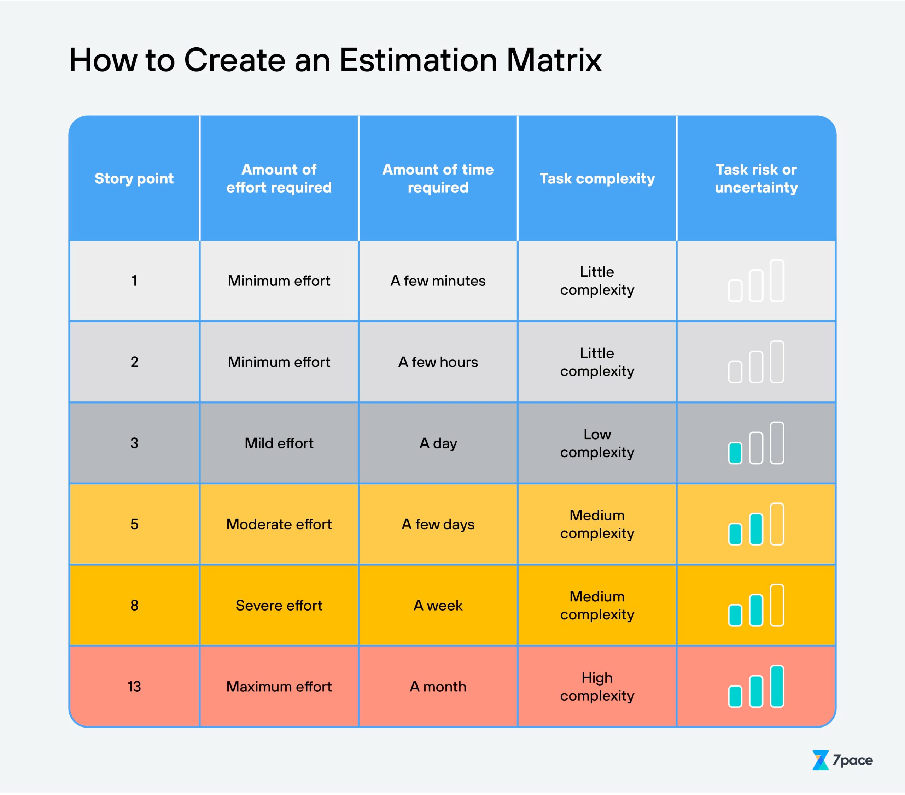

We have agreed to use the following for our story pointing guideline.

Additional pointers on Story Points

    We should target breaking tickets up into as small size as possible that result in value being delivered in “logical chunks”. 

    We should aim to have a majority of 1, 2, 3 point tickets, slightly fewer 5 point tickets, and fewer still 8 point tickets.

    Where possible tickets that could span multiple sprints should be avoided.

    In a week long Dodo sprint, 8 point tickets are high risk and should be avoided if possible.

        It’s OK to give tickets 8 and 13 points, but try to consider them to be placeholder tickets that are indicating work that needs more research and to be broken up into smaller tickets.

        In no circumstance will a 13 point ticket be allowed into a sprint.

 

Everything below this line are notes taken from courses on the topic of Sprint management.  They are included here for information on good practise and may be of interest, but should not be taken as gospel for Dodo.
Creating tickets/stories/tasks (currently just notes, will refine as we progress)

Reduce scope as much as is reasonable.  The Pareto principle.
DoD (not acceptance criteria):

Focus on the valuable outcomes - What matters to our customers?

Evolve over time based on feedback and experience.

Keep it as concise as possible.

Don’t overthink edge-cases.

Make it visible to any and all stakeholders.

Examples:

    How do we test?

    “stuff is tested” - What does this mean specifically?

    Response times?

    …

The Sprint

Required elements of a sprint:

    What do we want to achieve? - Goal

    How will we achieve it? - Plan

    How will we keep on track? - Scrum

    How will we know if we achieved it? - Review

    How will we do better next time? - Retro

We need all of the above together for each individual piece to make sense. (Think a stone arch - take one block out & it will collapse).
Sprint Planning

Inputs

    Objective

    Backlog

    Product increment

    Capacity & past performance

    1 improvement from retro

Outputs

    Sprint backlog (the board with lots of tickets initially in “Todo”)

 

 
Sprint Backlog

The Board.

The team’s plan to achieve the Sprint Goal.

It will change and adapt as more is learnt throughout the Sprint.

    Add tickets and remove them as additional details are learnt.

    Changes in scope are fine.

    If you bring things in do other tickets have to go out? (Probably)

    Should you adjust your goal? (Hopefully not, but possible if necessary)

    If change happens regularly, it’s a symptom of not enough planning.

    Predict the predictable, embrace the surprises.

Daily Scrum

Assess the current state of the plan.

NOT just a status update.

“Are we on track?  If not, what should be do about it?”
Sprint Review

We don’t do this very well in Skyscanner.

Have a separate Zoom link for Planning, Review & Retro.

Opportunity for stakeholders to be present

Gain perspective.

What has been accomplished this sprint?

What challenges has we experienced?

What might come next and are there any risks?

Discuss what competitors have done recently.

Discuss market changes and future opportunities.

    Recent example: ChatGPT - What does this mean for us?

        Should we explore ways to use it?

        Should we put it on our PDTs?

        New libraries new, frameworks?

Sprint Retro

How we worked together in the sprint

The retro is explicitly about seeking improvements

Consider:

    Individuals

    Interactions

    Processes

    Tools

    DoD

Select >= 1 action from the discussion to improve the next sprint.

Some kind of retro should happen each sprint, it may be that it can be a small thing for one or two weeks then a bigger thing on the next week.

Occasionally the retro should be highly focused on a specific topic.

Don’t just do the same retro format each week.  Can be the same most weeks, but mix it up liven things up and focus on different aspects of the sprint.
Overall

Timeboxed (<1 month) at a consistent duration.

Sprints deliver value by solving a meaningful problem.  Would a stakeholder be willing to spend time (or money) to upgrade to what you do in that sprint.

Sprints protect the team from distractions and changes in direction.
Scrum Team

    Cross functional

        Multi-skilled

    Stable composition of a team

        Constantly changing team limits psychological safety

        Difficult to understand strengths and weaknesses.

    <= 10 people

    Self-organising

        Leaders will emerge

        Different people will naturally start to take different roles.

        Squad leads should encourage self-organisation

    Non-hierarchical

        Different levels will have different ideas and different input.

        Sometimes less experienced people will see simpler solutions, for example.

        Fresh perspective can be valuable

Developer

Contributor to any aspect of a usable increment each sprint.

Able to plan the work to the goal and execute it.
Product Owner

Accountable for maximising the value of the product resulting from the work on the Scrum Team.

Accountable (not necessarily responsible) for:

    Developing and explicitly communicating the product goal

    Creating and comms for the Product Backlog

    Ordering (prioritising) the product backlog

    Ensure the product backlog is transparent, visible and understood.

Note for Prod Plat context: This doesn’t exist, role mostly falls to SL, but should be shared amongst the team.
Scrum Master

Servant leader.  Accountable for establishing Scrum as defined in the Scrum Guide.  They do this by helping everyone understand Scrum Theory and practice, both within the Scrum Team and the org.

    Coach team members in self-org

    Help team focus on high value increments

    Cause the removal of impediments

    Ensure all Scrum Events are positive, productive & efficient.

    Should be active and challenge the team during ceremonies.

Should not be rotated too quickly (if at all), no less than a month at a time.  Less than this doesn’t give the chance to make a change.
Backlog Refinement

An ongoing activity, by a very rough estimate it could take up to 10% of the Sprint capacity.

Backlog refinement should be a discovery exercise, working towards everybody understanding the work/roadmap.  Constantly strive to understand what’s coming up for the product.  Where are we today?  What could we do to improve going forwards?  Understand how other people in the company, or other people in the industry, are solving problems.

Creating Sprint-ready backlog items

    Re-prioritise

    New tickets created

    Unnecessary tickets removed

    Acceptance criteria added

    Larger tickets (or epics) broken up into end-to-end slices.

    Tickets are estimated (or thinly sliced to the same size)

Ticket Template can be useful, some ideas for it:

    What is the change?

    Why are we making it?

    Any useful links?

    Testing steps?

    Acceptance criteria.

Estimation

Watch the Agile Estimation Skyscanner University course for more detail.

    Should be quick & painless

    Should be collaborative involving the whole team

    The closer the work, the less valuable the estimate is in its own right and the more valuable the conversation is.

    Don’t get stuck between 2s and 3s - not a valuable conversation.  Remove one from consideration?

        Plandek - Look at average time to deliver story points; 2 and 3 points often have no difference.

    The are estimates, not quotes, not commitments, not promises or guarantees.

Forecasting progress

    Velocity: speed = distance / time

        Monte carlo estimation - probability based forecasting.

    Don’t plan the unplannable

        If there are unknowns, use larger brush strokes, refining the brush as we go along.

        Combined Explore Question Mark

    Use data to understand typical progress and trends

        Stakeholders will appreciate this.

    Don’t be lured by optimistic/pessimistic tendencies.

        Predict based on the data and trends you have.

Burndown charts

Plot expected progress vs actual progress

Not be-all-end-all, but useful.

Can be used mid-sprint to check if you’re on track.
When Scrum works and when it doesn’t

Scrums works pretty well most of the time.

Works well for complex problems with…

    unpredictabilty

    unknown-unknowns

    established general direction

Other models such as Kanban can work better for complicated problems:

    Predictable aspects

    Some unknowns, but mostly understoof

    Established end state

Could start with Scrum and when problems become complicated rather than complex you could move to Kanban.

 

 