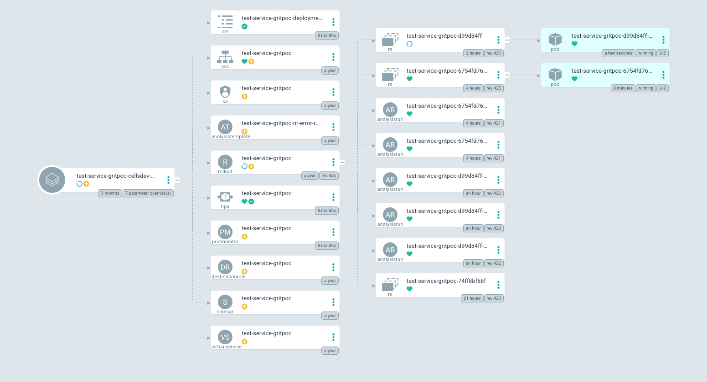
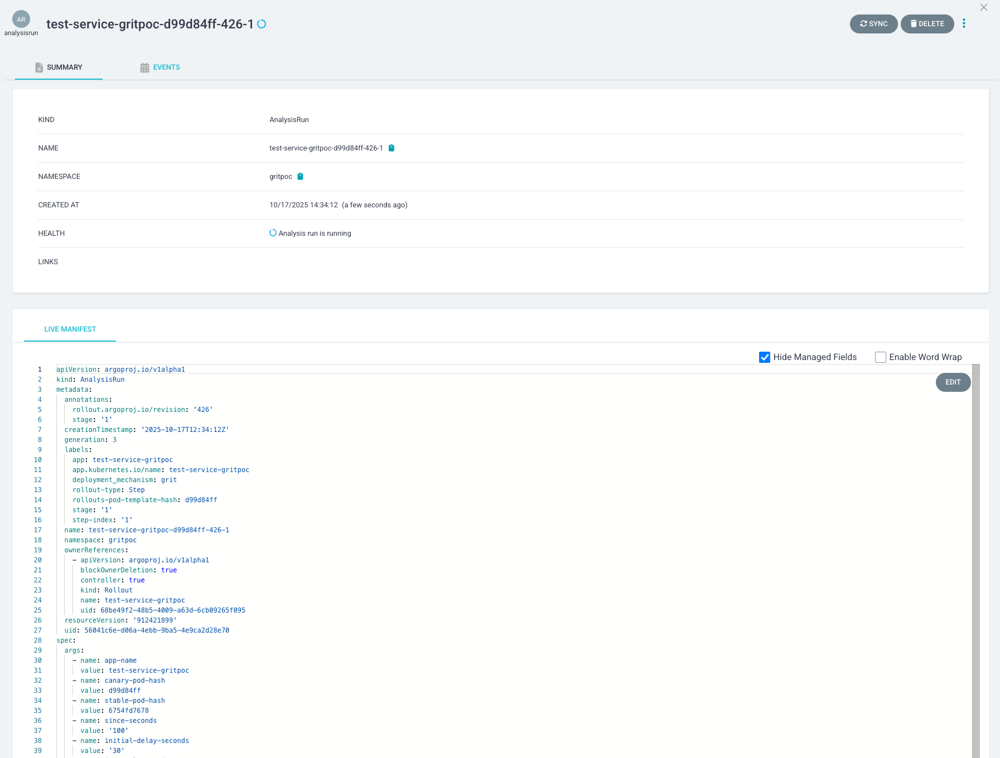
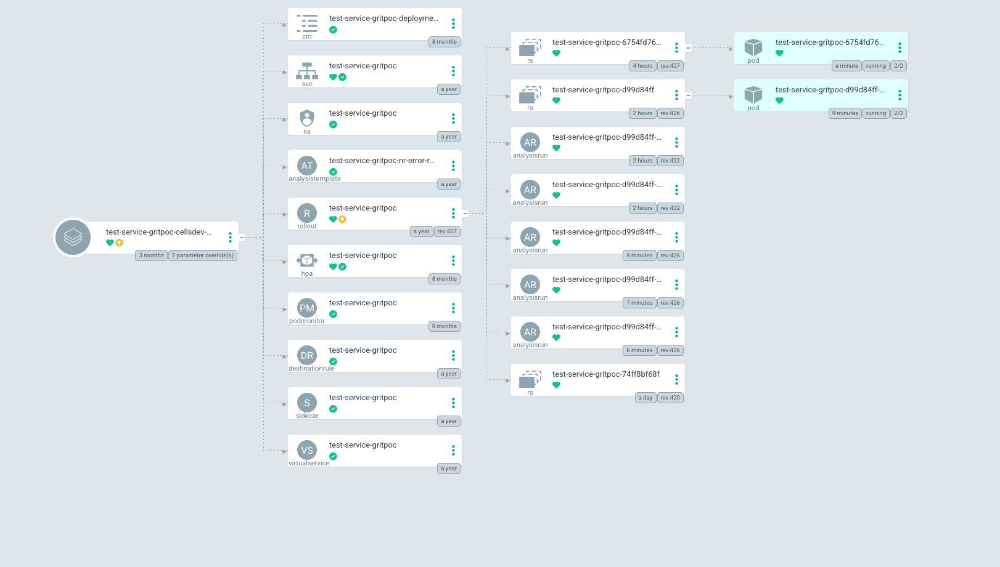

Rerunning a healthy deployment that's the current version

https://slingshot-test.skyscannertools.net/#!/workflow/test-service-gritpoc/test-service-gritpoc-20251017081147-Td5049/213vnmQjZgWZnSmTr9%252BYq0F4hiBHPNfAQm91bd2mEy7P4%253D/eu-central-1

Expectation:
Nothing to do, should complete very quickly

Observation:
No argocd sync triggered at all, since there were no changes to the state of the app in git
Completed in 1 min

Logs:

```log
2025-10-17 10:47:12.996 Workflow GitopsSingleCellServiceDeployment started  
2025-10-17 10:47:15.726 Activity Check previous deployment  
2025-10-17 10:47:15.828 └ No previous or dependent workflow execution for 'test-service-gritpoc' is running  
2025-10-17 10:47:20.029 Activity Check cell drain  
2025-10-17 10:47:20.789 └ Cell cellsdev-2-eu-central-1a-1 is not being drained.  
2025-10-17 10:47:22.623 Activity Fetch git app state  
2025-10-17 10:47:24.655 └ Fetched state of app applications/gritpoc/test-service-gritpoc/cellsdev-2-eu-central-1a-1  
2025-10-17 10:47:26.573 Activity Fetch argo app  
2025-10-17 10:47:27.303 └ Application test-service-gritpoc-cellsdev-2-eu-central-1a-1 (Healthy/OutOfSync) - Revision: 0cb6057e3576bb414a1190bf56353c3e277628f6 - Resources out of sync:
 - test-service-gritpoc - Rollout - OutOfSync - Synced (rollout.argoproj.io/test-service-gritpoc serverside-applied)

successfully synced (all tasks run)  
2025-10-17 10:47:27.511 └ Sending change tracking event for test-service-gritpoc - gitops-cells  
2025-10-17 10:47:29.439 Activity Send change tracking event  
2025-10-17 10:47:30.661 └ Change tracking event recorded  
2025-10-17 10:47:32.366 Activity Update git app state  
2025-10-17 10:47:34.711 └ Configs are unchanged  
2025-10-17 10:47:36.716 Activity Sync argo app  
2025-10-17 10:47:37.467 └ Syncing https://argocd-apps-dev.cellsctrl-1.skyscannerplatform.net/applications/argocd-apps-dev/test-service-gritpoc-cellsdev-2-eu-central-1a-1 with ['PruneLast=true', 'ServerSideApply=true']  - Resources out of sync:
 - test-service-gritpoc - Rollout - OutOfSync  
2025-10-17 10:48:09.690 Activity Fetch argo app  
2025-10-17 10:48:10.418 └ Application test-service-gritpoc-cellsdev-2-eu-central-1a-1 (Healthy/Synced) - Revision: 0cb6057e3576bb414a1190bf56353c3e277628f6 - Resources are in sync

successfully synced (all tasks run)  
2025-10-17 10:48:11.971 Activity Record deployment and resources  
2025-10-17 10:48:12.106 └ Deployment recorded successfully  
2025-10-17 10:48:13.091 └ GitopsSingleCellServiceDeployment completed: Deployment of test-service-gritpoc-cellsdev-2-eu-central-1a-1 completed. SHA: 0cb6057e3576bb414a1190bf56353c3e277628f6  
2025-10-17 10:48:13.263 └ GitopsSingleCellServiceDeployment duration: 00:01:01 (HH:MM:SS)  
```

----

Change something that will result in a different image digest and therefore a different pod template hash

```diff
diff --git a/prod.yml b/prod.yml
index b01f773..2fe3933 100644
--- a/prod.yml
+++ b/prod.yml
@@ -60,11 +60,11 @@ selfCall:
   http:
     requestsPerMinute: 100
     errorPercent: 0
-    concurrentRequests: 10
+    concurrentRequests: 15
   grpc:
     requestsPerMinute: 100
     errorPercent: 0
-    concurrentRequests: 10
+    concurrentRequests: 15
 
 clients:
   jersey:
```

Expectation:
A canary rollout takes place. It should be healthy and take the usual amount of time

Observation:

ArgoCD sync triggered which caused argo-rollouts to create a new replicaset with new podhash template. Pods are healthy and the sync has completed successfully.
Current rollback window 
```yml
  revisionHistoryLimit: 2
  rollbackWindow:
    revisions: 3
```

No explicit config for scaleDownSeconds or any other configs meaning we are using the defaults as per https://argo-rollouts.readthedocs.io/en/stable/features/specification/

```yml
      # Adds a delay before scaling down the previous ReplicaSet when the
      # canary strategy is used with traffic routing (default 30 seconds).
      # A delay in scaling down the previous ReplicaSet is needed after
      # switching the stable service selector to point to the new ReplicaSet,
      # in order to give time for traffic providers to re-target the new pods.
      # This value is ignored with basic, replica-weighted canary without
      # traffic routing.
      scaleDownDelaySeconds: 30

      # The minimum number of pods that will be requested for each ReplicaSet
      # when using traffic routed canary. This is to ensure high availability
      # of each ReplicaSet. Defaults to 1. +optional
      minPodsPerReplicaSet: 1

      # Limits the number of old RS that can run at one time before getting
      # scaled down. Defaults to nil
      scaleDownDelayRevisionLimit: nil
```

The old replicaset is getting scaled down and terminated. Controller logs
```json
[
  {
    "results": [
      {
        "events": [
          {
            "timestamp": 1760699349038,
            "container_name": null,
            "service.name": null,
            "message": "time=\"2025-10-17T11:09:09Z\" level=info msg=\"Scaled down old RSes\" namespace=gritpoc rollout=test-service-gritpoc",
            "cluster_name": "cellsdev-2-eu-central-1a-1"
          },
          {
            "timestamp": 1760699349038,
            "container_name": null,
            "service.name": null,
            "message": "time=\"2025-10-17T11:09:09Z\" level=info msg=\"Event(v1.ObjectReference{Kind:\\\"Rollout\\\", Namespace:\\\"gritpoc\\\", Name:\\\"test-service-gritpoc\\\", UID:\\\"68be49f2-48b5-4009-a63d-6cb09265f095\\\", APIVersion:\\\"argoproj.io/v1alpha1\\\", ResourceVersion:\\\"912279178\\\", FieldPath:\\\"\\\"}): type: 'Normal' reason: 'ScalingReplicaSet' Scaled down ReplicaSet test-service-gritpoc-6754fd7678 (revision 421) from 1 to 0\"",
            "cluster_name": "cellsdev-2-eu-central-1a-1"
          },
          {
            "timestamp": 1760699349038,
            "container_name": null,
            "service.name": null,
            "message": "time=\"2025-10-17T11:09:09Z\" level=info msg=\"Scaled down ReplicaSet test-service-gritpoc-6754fd7678 (revision 421) from 1 to 0\" event_reason=ScalingReplicaSet namespace=gritpoc rollout=test-service-gritpoc",
            "cluster_name": "cellsdev-2-eu-central-1a-1"
          },
          {
            "timestamp": 1760699349004,
            "container_name": null,
            "service.name": null,
            "message": "time=\"2025-10-17T11:09:09Z\" level=info msg=\"Found 2 available pods, scaling down old RSes (minAvailable: 1, maxScaleDown: 1)\" namespace=gritpoc rollout=test-service-gritpoc",
            "cluster_name": "cellsdev-2-eu-central-1a-1"
          },
          {
            "timestamp": 1760699319596,
            "container_name": null,
            "service.name": null,
            "message": "time=\"2025-10-17T11:08:39Z\" level=info msg=\"RS 'test-service-gritpoc-6754fd7678' has not reached the scaleDownTime\" namespace=gritpoc rollout=test-service-gritpoc",
            "cluster_name": "cellsdev-2-eu-central-1a-1"
          },
          {
            "timestamp": 1760699319596,
            "container_name": null,
            "service.name": null,
            "message": "time=\"2025-10-17T11:08:39Z\" level=info msg=\"Found 2 available pods, scaling down old RSes (minAvailable: 1, maxScaleDown: 1)\" namespace=gritpoc rollout=test-service-gritpoc",
            "cluster_name": "cellsdev-2-eu-central-1a-1"
          },
          {
            "timestamp": 1760699319593,
            "container_name": null,
            "service.name": null,
            "message": "time=\"2025-10-17T11:08:39Z\" level=info msg=\"RS 'test-service-gritpoc-6754fd7678' has not reached the scaleDownTime\" namespace=gritpoc rollout=test-service-gritpoc",
            "cluster_name": "cellsdev-2-eu-central-1a-1"
          },
          {
            "timestamp": 1760699319593,
            "container_name": null,
            "service.name": null,
            "message": "time=\"2025-10-17T11:08:39Z\" level=info msg=\"Found 2 available pods, scaling down old RSes (minAvailable: 1, maxScaleDown: 1)\" namespace=gritpoc rollout=test-service-gritpoc",
            "cluster_name": "cellsdev-2-eu-central-1a-1"
          },
          {
            "timestamp": 1760699319553,
            "container_name": null,
            "service.name": null,
            "message": "time=\"2025-10-17T11:08:39Z\" level=info msg=\"Found 2 available pods, scaling down old RSes (minAvailable: 1, maxScaleDown: 1)\" namespace=gritpoc rollout=test-service-gritpoc",
            "cluster_name": "cellsdev-2-eu-central-1a-1"
          },
          {
            "timestamp": 1760699319528,
            "container_name": null,
            "service.name": null,
            "message": "time=\"2025-10-17T11:08:39Z\" level=info msg=\"Skip scale down of older RS 'test-service-gritpoc-6754fd7678': still referenced\" namespace=gritpoc rollout=test-service-gritpoc",
            "cluster_name": "cellsdev-2-eu-central-1a-1"
          }
        ]
      }
    ],
  }
]

```
The old replicaset was scaled down after 30s as expected.

----

Rerunning previous deployment with rollback window (N-1 literarly)

Expectation:
Quick rollback, skipping canary since we are within rollback windows

Outcome:
Old replicaet 6754fd7678 restored and pods brought up. Analysis run for 6754fd7678 not repeated. New replicaset d99d84ff scaled down after 30s

Normal deployment time GitopsSingleCellServiceDeployment duration: 00:06:58 (HH:MM:SS)  


Analysis run for d99d84ff not always reused


Argo-rollouts recided to change revision for some reason even though pod hash was the same and to rerun the analysis run.

GitopsSingleCellServiceDeployment duration: 00:05:26 (HH:MM:SS) . Rollback time comparable to original deployment time. I would expect it to take 1-2 mins.

Going back faster from d99 to 675 also creates a new revision but analysis run is skipped??



And the deployment took as expected GitopsSingleCellServiceDeployment duration: 00:02:11 (HH:MM:SS) which is significantly faster.

Very confusing.. doint it again going from 675 to d99 this time ensuring that the previous replicaset has been completely scaled down..

It created a new revision again... so maybe this is expected? Could it be because of revision history? since it keeps on creating new revision? From which point does the revision history count?
Is 3 previous revisions too restrictive?

Aaaand it is running analysis run again. Has it been more than 3 revisions??? Not of commits but internal argo rollouts revs?


----

Rerunning previous deployment quickly within the default scaledown window

Expectation:
Update istio traffic shifting to the previous replicaset and scaledown the current stable after 30s

Outcome
Hard to reproduce, slingshot is too slow to do it in 30s, we may need to specify scaleDown explicitly and put it to a much longer window i.e 10 minutes. Doing it from argocd seems to work


